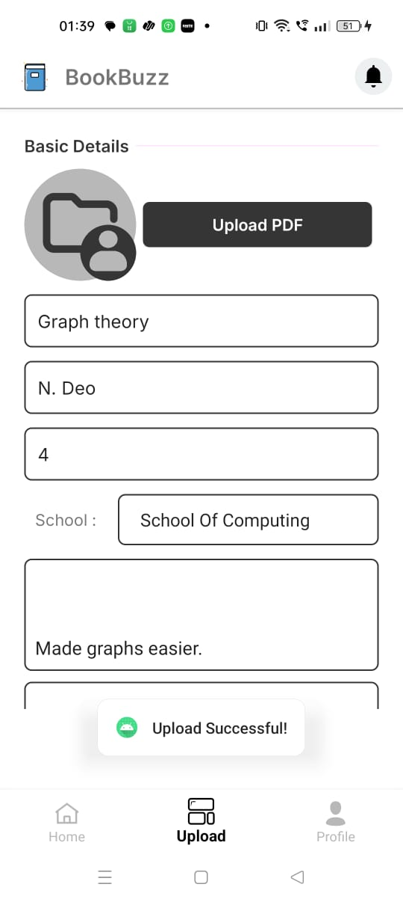

# 📚 IIIT Una Literary Application

## 📝 Overview

The **IIIT Una Literary Application** is a platform designed for students and teachers to:

- 📤 Upload books, notes, and academic resources  
- 📥 Download shared content  
- ⭐ Review and provide feedback on uploads  

🔐 Only institute-authorized users (students or faculty with IIIT Una email) can access the platform.

---

## 🏠 Home Page

Displays all uploaded books with key details like title, author, rating, and category.


---

## 📤 Book Upload

Authorized users can upload books along with the following fields:

- **Title**
- **Author**
- **B.Tech Year**
- **School/Department**
- **Description**
- **PDF File**

### 🔁 Upload Flow

1. Book metadata is stored in **MySQL**  
2. PDF file is uploaded to **Firebase Storage**  
3. A Kafka message is published to notify that a new book was uploaded  

📸 Screenshot:  


---

## 📖 Book Details & Reviews

Each book has a dedicated detail page displaying:

- 📘 Book information (title, author, description)  
- 📎 PDF download button  
- ⭐ Average rating and number of reviews  
- 💬 User comments and ratings  

Users can also post a review for any book they read.

📸 Book Details Screenshot:  


📸 Add Review Screenshot:  


---

## 🔐 Authorization Service

Ensures secure access control throughout the platform.

Only verified institute users can:

- ✅ Register and log in  
- 📤 Upload content  
- 📥 Download materials  
- ⭐ Post reviews  

---

## 🔁 Authentication Flow

1. **Signup (`/api/v1/signup`)**
   - Register using IIIT Una email
   - Save user info in database
   - Kafka event published

2. **Login (`/api/v1/login`)**
   - Authenticate credentials
   - Return JWT + refresh token

3. **Token Refresh (`/api/v1/refreshToken`)**
   - Validate refresh token
   - Issue new JWT

4. **Middleware**
   - Validates JWT on each request
   - Allows/denies actions based on authentication

📸 Sequence Diagram:  


---

## 🗃️ MySQL Database Design

### Key Tables

- `users`: stores user profiles and credentials  
- `users_roles`: maps users to roles like student or teacher  
- `tokens`: contains JWT refresh tokens  
- `books`: metadata for each uploaded book  
- `user_reviews`: ratings and comments per book  

📸 ER Diagram:  


---

## 🧰 Tech Stack

- **Spring Boot**
- **Spring Security**
- **JWT (JSON Web Tokens)**
- **Kafka**
- **MySQL**
- **Firebase Storage**

---

## 🏁 Getting Started

```bash
git clone https://github.com/your-username/iiit-una-literary-app.git
cd iiit-una-literary-app
./gradlew bootRun
